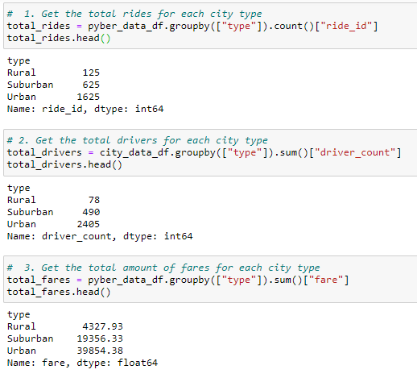
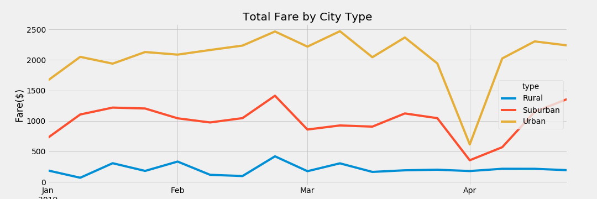
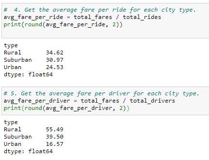

# PyBer_Analysis

## Overview of the analysis

The purpose of this analysis was to provide to V. Isualize a report that explains how the data can differ depending on the city type, in order to help her and the board to make decisions at PyBer.

## Results

Focusing on the outputs of this part of the code we can summarized the following:
 - Both total rides and total drivers have greater numbers in urban cities, followed by the suburban ones and lastly the rural cities. This in due to the relation of the population density that exists among the urban cities. To a higher population a higher demand on the transport service, therefore also a higher number of drivers to provide it. 
 - The total fares according to each city type is also related to what was mentioned before. Due to a higher demand on urban cities, the total fare amount is also the highest among the other types of cities. In the total fare by city type graph below we can have a better look of this:

Considering the calculations done for the averages fare:

 - I found that the average fare per ride is higher in rural cities, this could be due to the existence of higher distances between places in rural cities that in the urban ones. 
 - Regarding the average fare per driver, I found that the average fare for one driver in a rural city is more than three times higher that a driver in an urban city. This is related to the small quantity of drivers at rural cities compared to the amount in urban cities.

## Summary

To conclude I would like to give the following recommendations to increase the demand on certain cities:

1. Focus on increasing the number of drivers, especially in the rural cities. A campaign to attract drivers could be: making faster the process of accepting a new driver into the company’s system. 
2. Do promotions in the cities with less demand until now to incentive the people to using more this service. For example, a discount in your first trip using the company’s app.
3. Considering applying a lower fare for trips in the rural cities.

